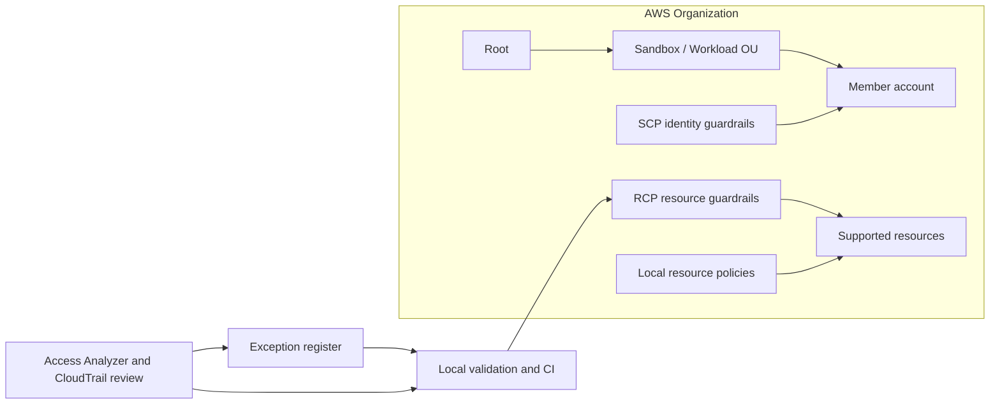

A small, opinionated starter kit for adopting AWS Organizations Resource Control Policies as part of an AWS data perimeter.

This repo is the companion artifact for:

`Beyond the SCP-Only Perimeter: Architecting AWS Data Perimeters with Resource Control Policies`

Companion article: `ARTICLE_URL_HERE`

## Why This Exists

Most AWS security programs start by governing identities. That is the right place to start. IAM policies, permission boundaries, and service control policies (SCPs) are still essential.

But identity-side controls do not fully answer a different question: what should resources in your accounts be allowed to accept through resource-based policies?

S3 bucket policies, KMS key policies, SQS queue policies, Secrets Manager resource policies, and AWS Sign-In resource policies can all create inbound paths. Resource Control Policies (RCPs) give you an AWS Organizations guardrail on the resource side for supported services.

The useful part is not one deny statement. It is the operating loop: policy, exception record, validation, and staged rollout.

This repo keeps that loop small on purpose:

- A few curated RCP examples.
- One complementary SCP for KMS administration.
- An exception register.
- A local validator.
- A staged rollout runbook.

The exception list is the perimeter.

## SCPs and RCPs

SCPs set maximum available permissions for identities in AWS Organizations member accounts. They do not grant permissions, and they do not govern external principals outside your organization.

RCPs set maximum resource-side permissions for supported resources in member accounts. They also do not grant permissions. They limit what those resources are allowed to accept.

Neither layer replaces IAM. Neither layer replaces local resource policies. A real data perimeter still depends on identity policies, resource policies, SCPs, RCPs, VPC endpoint policies, service-specific controls, logging, analysis, and exception governance.

## What This Repo Does Not Do

This is not Terraform, CDK, CloudFormation, a deployment framework, a policy generator, or a complete policy library.

The policies are reference patterns. They are not production-ready copy/paste controls.

## Architecture



## Included Examples

| File | Type | Why it is here |
| --- | --- | --- |
| `policies/resource-control-policies/01-trusted-identity-perimeter.json` | RCP | Denies selected supported resource access when the principal is outside `o-xxxxxxxxxx`, excluding AWS service principals. |
| `policies/resource-control-policies/02-kms-cryptographic-boundary.json` | RCP | Denies customer-managed KMS key usage and grant creation by principals outside the organization. |
| `policies/resource-control-policies/03-aws-service-confused-deputy-boundary.json` | RCP | Shows how to constrain AWS service-principal access with source organization and source account context. |
| `policies/resource-control-policies/04-s3-transport-boundary.json` | RCP | Separates HTTPS enforcement from S3 TLS-version enforcement. |
| `policies/resource-control-policies/05-console-signin-network-boundary.json` | RCP | Models cautious AWS Management Console sign-in network controls using AWS Sign-In RCP actions. |
| `policies/service-control-policies/kms-grant-administration-boundary.json` | SCP | Shows the identity-side companion control for sensitive KMS administration. |

## Important Caveats

The KMS RCP is for customer-managed keys. AWS documents that RCPs do not apply to AWS managed KMS keys and do not affect `kms:RetireGrant`. KMS grant and key administration still need identity-side governance, which is why this repo includes the companion SCP.

The S3 transport example uses TLS 1.2 as the conservative minimum. Do not move to TLS 1.3 enforcement without checking endpoint compatibility and legacy clients.

The confused-deputy example does not blindly trust every AWS service principal. It also does not pretend service integrations are simple. Test logging, encryption, eventing, delivery, and vendor flows before widening scope.

The AWS Sign-In example can lock people out. It does not govern programmatic access using access keys or SigV4-signed API calls. Test excluded principals and recovery paths before enabling console authorization.

## Quick Start

1. Replace placeholders: `o-xxxxxxxxxx`, `123456789012`, `203.0.113.0/24`, `vpc-0abc123def456789`, `REGION_HERE`, and `arn:aws:iam::123456789012:role/BreakGlassRole`.
2. Run the local checks:

   ```bash
   python tools/validate_policy_pack.py
   python -m unittest
   ```

3. Review `exceptions/exception-register.example.json` as a real control artifact, not sample metadata.
4. Test in a sandbox account or sandbox OU.
5. Use IAM Access Analyzer where useful and review CloudTrail denied events. These tools reduce blind spots; they do not prove safety.
6. Move one OU at a time. Attach at root only after lower-scope validation and a rollback path are in place.

## Production Warning

RCPs are preventive controls. They can break workloads, AWS service integrations, cross-account access, vendor access, and console sign-in.

Before using these patterns, re-check current AWS documentation for RCP supported services, quotas, AWS Sign-In behavior, KMS limitations, and service-linked role behavior. AWS service support changes over time.

## Source Notes

These notes are here because stale AWS assumptions make bad guardrails. The repo was reviewed on 2026-06-24 against official AWS documentation.

At that time, AWS documented:

- RCPs are AWS Organizations policies that attach to root, OU, or account.
- RCPs do not grant access and apply only to supported services in member accounts.
- Customer-managed RCPs use `Effect: Deny`, `Principal: "*"`, no `NotAction`, no `NotPrincipal`, and no bare global `Action: "*"`.
- RCP policy size is 5,120 characters; SCP policy size is 10,240 characters.
- Up to 5 RCPs can be directly attached to root, OU, or account; `RCPFullAWSAccess` counts toward that quota.
- Up to 10 SCPs can be directly attached to root, OU, or account.
- RCPs do not affect management-account resources, service-linked roles, AWS managed KMS keys, or `kms:RetireGrant`.
- SCPs do not affect users or roles in the management account, do not grant permissions, and do not affect external principals outside the organization.
- AWS Sign-In RCPs use `signin:Authenticate` before authentication and `signin:AuthorizeOAuth2Access` / `signin:CreateOAuth2Token` after authentication; console authorization must be enabled before statements take effect.

Re-check before publication or use:

- RCP supported services.
- AWS Organizations quotas.
- AWS Sign-In behavior.
- KMS RCP caveats.

## Official References Reviewed

- [AWS Organizations: Resource control policies](https://docs.aws.amazon.com/organizations/latest/userguide/orgs_manage_policies_rcps.html)
- [AWS Organizations: RCP syntax](https://docs.aws.amazon.com/organizations/latest/userguide/orgs_manage_policies_rcps_syntax.html)
- [AWS Organizations: Service control policies](https://docs.aws.amazon.com/organizations/latest/userguide/orgs_manage_policies_scps.html)
- [AWS Organizations: SCP syntax](https://docs.aws.amazon.com/organizations/latest/userguide/orgs_manage_policies_scps_syntax.html)
- [AWS Organizations: SCP evaluation](https://docs.aws.amazon.com/organizations/latest/userguide/orgs_manage_policies_scps_evaluation.html)
- [AWS Organizations quotas and policy size limits](https://docs.aws.amazon.com/organizations/latest/userguide/orgs_reference_limits.html)
- [IAM: Data perimeters](https://docs.aws.amazon.com/IAM/latest/UserGuide/access_policies_data-perimeters.html)
- [IAM global condition context keys](https://docs.aws.amazon.com/IAM/latest/UserGuide/reference_policies_condition-keys.html)
- [IAM condition operators](https://docs.aws.amazon.com/IAM/latest/UserGuide/reference_policies_elements_condition_operators.html)
- [IAM Access Analyzer](https://docs.aws.amazon.com/IAM/latest/UserGuide/what-is-access-analyzer.html)
- [Amazon S3 policy keys, including `s3:TlsVersion`](https://docs.aws.amazon.com/AmazonS3/latest/userguide/amazon-s3-policy-keys.html)
- [AWS Sign-In console access control with resource policies and RCPs](https://docs.aws.amazon.com/signin/latest/userguide/console-access-control.html)
- [AWS Sign-In condition keys reference](https://docs.aws.amazon.com/signin/latest/userguide/reference-signin-condition-keys.html)
- [AWS Sign-In Service Authorization Reference](https://docs.aws.amazon.com/service-authorization/latest/reference/list_awssignin.html)
