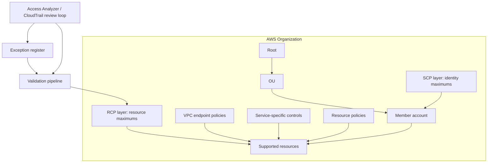

# Architecture

In production, no single policy layer gets the final vote. This repo models that layered view.

SCPs sit on the identity side. They set the maximum available permissions for IAM users and roles in member accounts. They are useful for Region boundaries, dangerous administrative actions, service-use boundaries, and KMS grant or key-administration governance.

RCPs sit on the resource side. They set the maximum permissions that supported resources in member accounts can accept. RCPs do not grant access.

Local policies still matter. A request can be affected by identity policies, SCPs, RCPs, resource policies, VPC endpoint policies, session policies, permission boundaries, and service-specific authorization rules. A bucket policy, key policy, queue policy, or Sign-In resource policy is still part of the real authorization path.

Use RCPs for organization-wide invariants that should rarely change. Keep application-specific rules close to the application.

The five RCP files in this repo are examples, not an attachment plan. With the current documented quota, `RCPFullAWSAccess` counts toward the five direct RCP attachments allowed on a root, OU, or account, leaving four customer-managed RCP slots at that target. Choose the controls you need and validate minified size before attachment.

## Current AWS Behavior To Recheck

Re-check the current AWS Organizations documentation before attaching anything. At the time this repo was reviewed, AWS documented these constraints:

- Customer-managed RCP statements use `Effect: Deny`.
- RCP `Principal` must be `"*"`.
- RCPs do not support `NotPrincipal` or `NotAction`.
- Customer-managed RCPs cannot use a bare global `Action: "*"`.
- RCP policy size is 5,120 characters.
- Up to 5 RCPs can be directly attached to a root, OU, or account, and `RCPFullAWSAccess` counts toward that quota.
- SCP policy size is 10,240 characters.
- Up to 10 SCPs can be directly attached to a root, OU, or account.
- RCPs do not affect resources in the management account.
- RCPs do not restrict service-linked roles.
- RCPs do not apply to AWS managed KMS keys.
- RCPs do not affect `kms:RetireGrant`.
- SCPs do not affect users or roles in the management account, external principals outside the organization, or service-linked roles.

Treat support lists as temporary facts. AWS can add or change RCP service support.
